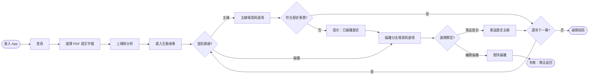
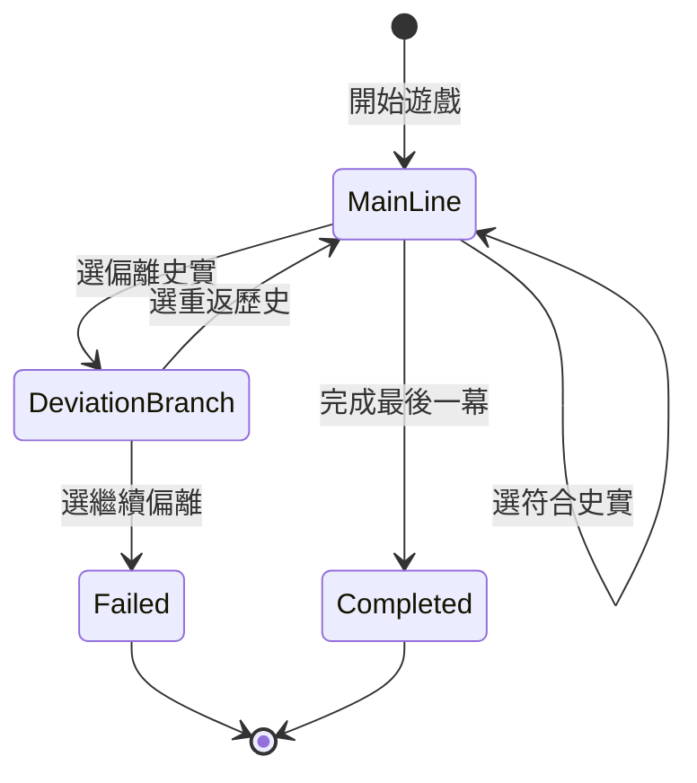
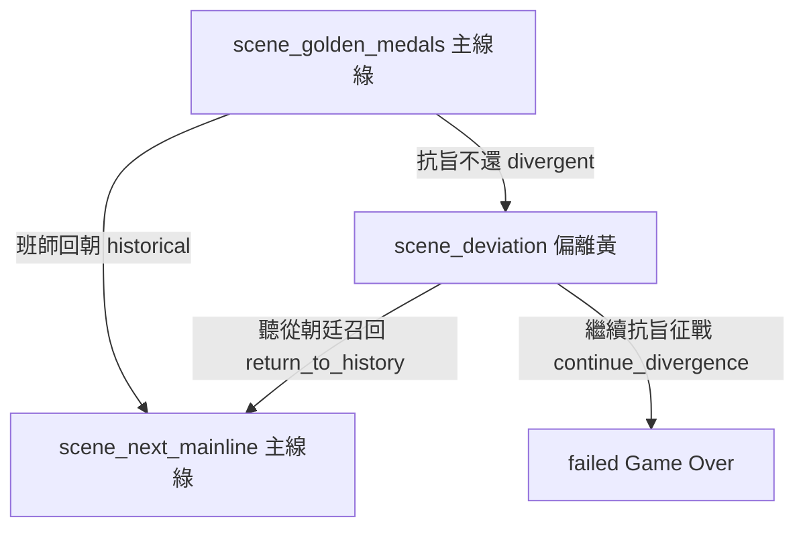
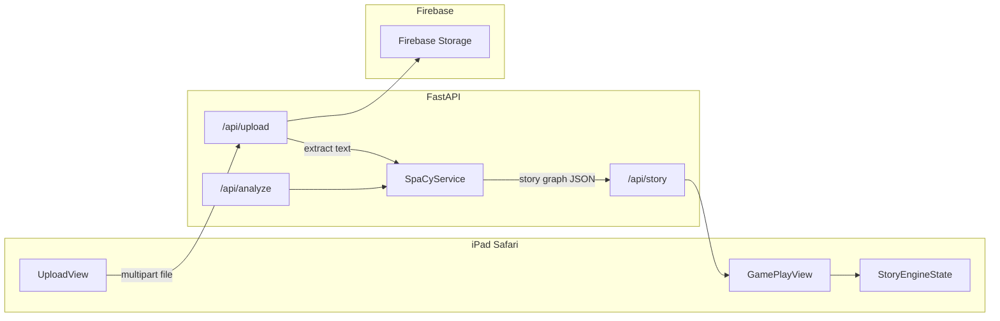

# 互動故事遊戲 — 實作計畫（PLAN.md）

## 背景與目標

開發一個 Web 應用，讓使用者上傳書籍或 PDF，系統自動分析內容並轉化為互動故事體驗。目標是吸引年輕讀者（尤其 11 歲中學生）更深入理解故事。

**成功標準**：使用者能順利上傳檔案，並在**雙路線互動故事**中體驗「符合史實繼續主線 / 偏離進入分支 / 重返或失敗」的核心玩法。

### 設計決策紀錄（2026-06-06）

| 曾考慮 | 最終決定 | 原因 |
|--------|----------|------|
| 線性「下一幕」、無分支 | ❌ 捨棄 | 缺乏互動性，唔符合「遊戲化閱讀」目標 |
| 一偏離歷史即時失敗 | ❌ 捨棄 | 對 11 歲玩家太嚴苛，唔俾修正空間 |
| **偏離 → 下一幕可重返；堅持偏離先失敗** | ✅ 採用 | 俾一次「走偏再回頭」機會，同時強化史實重要性 |

**FigJam 流程圖**（設計討論產物）：[劇本遊戲 FigJam](https://www.figma.com/board/M6s9YrUHxmse4xDCrpVVJ0) — 含「玩家完整流程」「偏離與回歸機制」等圖表。

## 用戶與場景

| 角色 | 情境 |
|------|------|
| 11 歲中學生 | 想讓閱讀更有趣，願意與故事互動 |
| 家長 | 希望提升孩子閱讀興趣，協助上傳教材 |

現況：市面缺乏針對年輕讀者的「閱讀 + 互動」產品；電子書與遊戲未能有效結合。

---

## 完整玩家流程（進入遊戲 → 結局）

由開 App 到通關／失敗嘅端到端路徑：



**重點**：`mainCheck` 揀偏離時**唔會**直去 `failState`，而係經 `driftWarn` 進入偏離分支；只有喺偏離分支揀「繼續偏離」先至失敗。

---

## 核心遊戲規則（兩條路線）

玩家**任何時刻**必虈處於以下兩條路線之一。UI 以顏色區分：**主線 = 綠色**、**偏離分支 = 黃色**。

### 路線 A：歷史主線（綠色）

- 每幕提供多個選項
- **揀符合史實** → 進入下一幕，**仍留在主線**
- **揀偏離史實** → **唔會即時失敗**，而係**進入偏離分支（黃色）**

### 路線 B：偏離分支（黃色）

- 系統顯示提示：「**已偏離歷史**」
- 下一幕選項包含**兩類**（可同時出現）：
  - **重返歷史** → 翻返主線，故事從對應主線節點繼續
  - **繼續偏離** → 無法返回原故事 → **失敗（Game Over）**

### 狀態機



### 設計原則

| 原則 | 說明 |
|------|------|
| 偏離非即死 | 第一次選錯只進黃色分支，給玩家修正機會 |
| 分支有代價 | 「繼續偏離」= 明確失敗，強化史實選擇的重要性 |
| 視覺一致 | 主線全綠色調元件；偏離全黃色調 + 頂部橫幅提示 |
| 兒童友善 | 失敗文案鼓勵重試（例：「歷史走了另一條路，要再試一次嗎？」） |

### 範例 walkthrough：岳飛十二道金牌（MVP 標準 fixture）

以下為 PLAN 內** canonical 範例**，Task 3/4 驗收與 demo 均以此為準。

```
【主線 · 綠】scene_golden_medals：岳飛收到十二道金牌
  ├─ 選「班師回朝」     → historical   → scene_next_mainline（符合史實，留主線）
  └─ 選「抗旨不還」     → divergent    → scene_deviation（偏離史實，唔失敗）

【偏離 · 黃】scene_deviation：你走上咗另一條路
  ⚠ 橫幅：「已偏離歷史」
  ├─ 選「聽從朝廷召回」 → return_to_history → scene_next_mainline（重返主線）
  └─ 選「繼續抗旨征戰」 → continue_divergence → failed（堅持偏離，無法返回）
```

**三條玩家路徑**

| 路徑 | 選擇序列 | 結果 |
|------|----------|------|
| A 通關 | 班師回朝 → … | 留主線，進下一幕 |
| B 修正 | 抗旨不還 → 聽從朝廷召回 | 曾偏離（黃），重返主線繼續 |
| C 失敗 | 抗旨不還 → 繼續抗旨征戰 | Game Over |



**對應 fixture 檔**（實作時置於 `backend/fixtures/yuefei_golden_medals.json`）：

```json
{
  "title": "岳飛：十二道金牌",
  "startSceneId": "scene_golden_medals",
  "scenes": {
    "scene_golden_medals": {
      "id": "scene_golden_medals",
      "route": "mainline",
      "narrative": "前方連戰連捷，突然十二道金牌連連——朝廷催岳飛立刻班師回朝。",
      "choices": [
        {"id": "c_return", "label": "班師回朝", "type": "historical", "nextSceneId": "scene_next_mainline"},
        {"id": "c_defy", "label": "抗旨不還", "type": "divergent", "nextSceneId": "scene_deviation"}
      ]
    },
    "scene_deviation": {
      "id": "scene_deviation",
      "route": "deviation",
      "narrative": "你選擇抗旨不還，繼續揮師北上——歷史在此拐了彎。",
      "resumeMainlineSceneId": "scene_next_mainline",
      "choices": [
        {"id": "c_recall", "label": "聽從朝廷召回", "type": "return_to_history", "nextSceneId": "scene_next_mainline"},
        {"id": "c_persist", "label": "繼續抗旨征戰", "type": "continue_divergence", "nextSceneId": "failed"}
      ]
    },
    "scene_next_mainline": {
      "id": "scene_next_mainline",
      "route": "mainline",
      "narrative": "岳飛班師回朝，風波暗湧……（下一幕主線，MVP 可為佔位結束幕）",
      "choices": []
    }
  }
}
```

> `continue_divergence` 唔需要真實 `failed` scene 節點——引擎收到此 type 直接設 `status = failed` 並顯示 Game Over UI。

---

## 技術決策（已確認 / 建議）

| 項目 | 決定 | 理由 |
|------|------|------|
| 前端 | **Web App（Vite + React + TypeScript）** | 你已選 Web；iPad Safari 可直接使用；與 Python NLP 後端整合最簡單 |
| 後端 | **Python FastAPI** | SpaCy 生態成熟；REST API 供前端呼叫 |
| NLP | **SpaCy**（`zh_core_web_sm` 或 `en_core_web_sm`） | 比 NLTK 更適合結構化實體/句法分析；NLTK 僅作備援評估 |
| 檔案儲存 | **Firebase Storage**（MVP 建議） | 設定快、SDK 完善；比 AWS S3 更適合快速驗證 |
| PDF 擷取 | **後端 `pymupdf` / `pdfplumber`** | 比純前端更穩定；MVP 也可支援 `.txt` 純文字上傳降低複雜度 |
| 設計 | **Figma** | 已有空白檔：[劇本遊戲 Figma](https://www.figma.com/design/Hv3LRFc4OhrUspopNUbFhq)（file key: `Hv3LRFc4OhrUspopNUbFhq`） |

### 架構概覽



### 建議目錄結構（從零初始化）

```
/Users/caroline/Developer/劇本遊戲/
├── docs/
│   └── PLAN.md                 # 本計畫（實作後寫入）
├── frontend/
│   ├── index.html
│   ├── package.json
│   └── src/
│       ├── views/UploadView.tsx
│       ├── views/AnalysisResultView.tsx
│       ├── views/GamePlayView.tsx
│       ├── engine/storyEngine.ts      # 主線/偏離狀態機
│       ├── models/story.ts
│       ├── services/uploadService.ts
│       └── services/analyzeService.ts
├── backend/
│   ├── requirements.txt
│   ├── main.py
│   └── services/
│       ├── storage_service.py    # Firebase Admin SDK
│       ├── pdf_service.py
│       └── nlp_service.py        # SpaCy
├── .env.example
└── README.md
```

**參考專案**（同 Developer 目錄，非本 repo）：[MemoryShot](/Users/caroline/Developer/MemoryShot/) 的 Service 分層與 XcodeGen 模式可作 iOS 未來移植參考。

---

## 功能需求（FR）

### FR-1 上傳檔案功能（P0 — MVP 核心）

- 使用者可選擇 `.pdf`、`.txt`（MVP）；`.epub` 列 Phase 2
- 上傳過程顯示進度與錯誤提示（兒童友善文案）
- 檔案成功寫入 Firebase Storage，並回傳 `fileId` / URL

**驗收標準**
- 可選檔並成功上傳
- 系統持久化儲存
- 上傳過程無未處理錯誤（需有 try/catch + 使用者可讀訊息）

### FR-2 文本分析功能（P0 — MVP 核心）

- 從上傳檔案擷取純文字
- SpaCy 解析：**主要角色**（PERSON/ORG 實體）、**情節摘要**（句段聚類或 extractive summary）、**場景/地點**（LOC/GPE）
- 輸出固定 JSON schema，供前端渲染

**驗收標準**
- 能識別至少 1 個角色與 1 段情節結構
- 分析結果以結構化 JSON 呈現

**分析輸出 Schema**（NLP 中間格式）

```json
{
  "title": "string",
  "characters": [{"name": "string", "mentions": 0}],
  "plotBeats": [{"order": 1, "summary": "string"}],
  "settings": ["string"],
  "rawTextLength": 0
}
```

### FR-3 雙路線互動故事（P0 — 核心玩法）

由 NLP 分析結果生成**可玩的分支劇本**，實作「核心遊戲規則（兩條路線）」。

**每幕（Scene）必須包含**
- `id`、`narrative`（旁白）、`route`（`mainline` | `deviation`）
- `choices[]`：每個選項含 `label`、`type`、`nextSceneId`

**選項類型（ChoiceType）**

| type | 路線 | 效果 |
|------|------|------|
| `historical` | 主線（綠） | 留主線 → 下一主線幕 |
| `divergent` | 主線（綠） | 進偏離分支 → 偏離幕（非即死） |
| `return_to_history` | 偏離（黃） | 重返主線 → 對應 `resumeMainlineSceneId` |
| `continue_divergence` | 偏離（黃） | 失敗 → Game Over 畫面 |

**劇本 Graph Schema**（供前端引擎消费）

```json
{
  "title": "string",
  "startSceneId": "scene_1",
  "scenes": {
    "scene_1": {
      "id": "scene_1",
      "route": "mainline",
      "narrative": "幕次描述...",
      "choices": [
        {"id": "c1", "label": "符合史實的選擇", "type": "historical", "nextSceneId": "scene_2"},
        {"id": "c2", "label": "偏離史實的選擇", "type": "divergent", "nextSceneId": "deviation_1"}
      ]
    },
    "deviation_1": {
      "id": "deviation_1",
      "route": "deviation",
      "narrative": "你做了不同於歷史的決定...",
      "resumeMainlineSceneId": "scene_2",
      "choices": [
        {"id": "c3", "label": "重返歷史", "type": "return_to_history", "nextSceneId": "scene_2"},
        {"id": "c4", "label": "繼續偏離", "type": "continue_divergence", "nextSceneId": "failed"}
      ]
    }
  }
}
```

**UI 要求**
- 主線：綠色進度條 / 邊框 / 選項按鈕
- 偏離：黃色橫幅「已偏離歷史」+ 黃色選項區
- 失敗：全屏 Game Over + 重試按鈕（回到 `startSceneId` 或上一主線幕）

**驗收標準**
- 可走完：主線全對 → 通關
- 可觸發：主線選偏離 → 黃色分支 → 重返主線 → 繼續
- 可觸發：偏離分支選「繼續偏離」→ 失敗畫面
- 至少 3 幕主線 + 1 幕偏離節點（MVP fixture 劇本即可）

---

## 非功能需求

- 無特殊 SLA；MVP 以本機 / 開發環境可跑為準
- iPad Safari 響應式：最小寬度 768px，觸控目標 ≥ 44pt
- 11 歲友善：大字、高對比、少步驟、錯誤訊息不用技術術語

---

## 實作任務分解（按序執行）

### Task 1：設計上傳介面原型（Figma）

**目的**：建立兒童友善的上傳流程原型，作為前端實作依據。

**步驟**
1. 在 Figma 檔 `Hv3LRFc4OhrUspopNUbFhq` 建立 **iPad 1024×768** 畫框
2. 設計元件：
   - 主標題（例：「把故事變成遊戲！」）
   - 大型拖放區 /「選擇檔案」按鈕（≥ 56px 高）
   - 支援格式提示（PDF、文字檔）
   - 上傳中狀態（進度條 + 鼓勵文案）
   - 成功 / 失敗狀態
3. 設計 token：圓角 16px、主色飽和度偏高、字級 body ≥ 18px
4. 加 **遊戲玩法** 畫框（Task 4 對照）：
   - 主線狀態（綠）：幕次旁白 + 2+ 選項
   - 偏離狀態（黃）：「已偏離歷史」橫幅 + 重返/繼續偏離選項
   - 失敗狀態：Game Over + 重試
5. Figma variables：`color/mainline-green`、`color/deviation-yellow`

**涉及範圍**：Figma Views；產出連結供 Task 2 對照

**完成定義（DoD）**
- Figma 可點擊原型：選檔 → 上傳中 → 成功
- 設計評审：11 歲用戶能在 3 步內理解如何上傳

**Agent 提示**：使用 `/figma-generate-design` + `/figma-use` skills；勿憑空 hardcode 色值，在 Figma 建立 variables。

---

### Task 2：實現上傳功能

**目的**：後端接收檔案並存入 Firebase Storage；前端完成上傳 UI。

**步驟**

1. **初始化 repo**
   - `git init`、`.gitignore`、`.env.example`
   - 前端：`npm create vite@latest frontend -- --template react-ts`
   - 後端：`backend/requirements.txt`（fastapi, uvicorn, python-multipart, firebase-admin, pymupdf）

2. **Firebase 設定**
   - 建立 Firebase 專案，啟用 Storage
   - 下載 service account JSON（**勿 commit**）
   - 實作 [`backend/services/storage_service.py`](backend/services/storage_service.py)：`upload_file(file) -> {url, path}`

3. **API**
   - `POST /api/upload`：接收 multipart，存 Storage，回傳 metadata
   - `GET /api/health`：健康檢查
   - CORS 允許 frontend dev origin

4. **前端 UploadView**
   - 對照 Figma 實作 [`frontend/src/views/UploadView.tsx`](frontend/src/views/UploadView.tsx)
   - [`frontend/src/services/uploadService.ts`](frontend/src/services/uploadService.ts) 呼叫 API
   - 檔案類型驗證、大小上限（例：20MB）

5. **驗證**
   - 手動：iPad Safari 或 Chrome 裝置模擬上傳 PDF/txt
   - 確認 Firebase Console 可見檔案

**涉及範圍**：`frontend/`、`backend/`、`Services`

**DoD**
- 上傳 API 200 回傳有效 URL
- 前端顯示成功狀態
- 錯誤情境（錯誤副檔名、超大小）有友善提示

---

### Task 3：集成文本分析工具

**目的**：SpaCy 解析上傳文本，回傳結構化 JSON，並轉換為**雙路線劇本 Graph**。

**步驟**

1. **評估並選型**（文件化於 README）
   - SpaCy vs NLTK：選 **SpaCy**（NER、依存句法）
   - 安裝模型：`python -m spacy download zh_core_web_sm`（中文）或 `en_core_web_sm`（英文）

2. **PDF / 文字擷取**
   - [`backend/services/pdf_service.py`](backend/services/pdf_service.py)：PDF → plain text
   - `.txt` 直接讀取

3. **NLP 邏輯** — [`backend/services/nlp_service.py`](backend/services/nlp_service.py)
   - `extract_characters(doc)`：PERSON 實體 + 詞頻
   - `extract_plot_beats(text)`：按段落/章節切分 + 每段首句摘要（MVP）
   - `extract_settings(doc)`：LOC/GPE 實體

4. **劇本生成** — [`backend/services/story_generator.py`](backend/services/story_generator.py)
   - 輸入 `plotBeats` → 輸出符合 FR-3 **劇本 Graph Schema**
   - 每幕自動生成：`historical` 選項（接下一幕）+ `divergent` 選項（接偏離幕）
   - 偏離幕自動附：`return_to_history` + `continue_divergence`
   - MVP 先用 **岳飛十二道金牌 fixture**（`backend/fixtures/yuefei_golden_medals.json`，見上方範例）驗證引擎，再接入 NLP 自動生成

5. **API**
   - `POST /api/analyze`：body `{ fileId | storagePath }` → `{ analysis, storyGraph }`
   - `GET /api/story/:id`：取得已生成劇本（可選）

6. **前端**
   - [`frontend/src/views/AnalysisResultView.tsx`](frontend/src/views/AnalysisResultView.tsx)：角色 chips + 情節列表 +「開始遊戲」按鈕

7. **驗證**
   - 準備 fixture：`yuefei_golden_medals.json`（≥1 主線幕 + 1 偏離幕 + 1 下一主線幕）
   - assert schema 欄位完整、`startSceneId` 可達所有節點

**涉及範圍**：`backend/services/`、`frontend/src/views/`

**DoD**
- API 回傳合法 `storyGraph`
- AnalysisResultView 可預覽角色/情節並進入遊戲

---

### Task 4：雙路線故事引擎與遊戲 UI

**目的**：實作 FR-3 核心玩法——主線（綠）/ 偏離（黃）/ 失敗狀態機。

**步驟**

1. **狀態機** — [`frontend/src/engine/storyEngine.ts`](frontend/src/engine/storyEngine.ts)
   - state：`currentSceneId`、`route`（`mainline` | `deviation`）、`status`（`playing` | `failed` | `completed`）
   - `choose(choiceId)`：依 `ChoiceType` 轉換狀態（見核心規則）
   - `return_to_history` 使用 scene 的 `resumeMainlineSceneId`
   - `continue_divergence` → `status = failed`（唔需要額外 scene 節點）

2. **GamePlayView** — [`frontend/src/views/GamePlayView.tsx`](frontend/src/views/GamePlayView.tsx)
   - 對照 Figma：綠/黃視覺狀態
   - 偏離時頂部固定橫幅：「已偏離歷史」
   - 選項按鈕依 route 上色
   - Game Over 全屏 + 重試（reset 至 `startSceneId`）

3. **測試情境**（手動或 vitest，以岳飛 fixture 為準）
   - 路徑 A：班師回朝 → 進 `scene_next_mainline`
   - 路徑 B：抗旨不還 → 聽從朝廷召回 → 進 `scene_next_mainline`（曾顯示黃色偏離）
   - 路徑 C：抗旨不還 → 繼續抗旨征戰 → `failed`

4. **驗證**
   - iPad Safari 觸控測試三條路徑
   - 確認偏離時**唔會**即時失敗

**涉及範圍**：`frontend/src/engine/`、`frontend/src/views/GamePlayView.tsx`

**DoD**
- 三條驗收路徑全部可走通
- UI 顏色與 Figma 主線綠/偏離黃一致

---

## 測試與驗證

| 類型 | 項目 |
|------|------|
| 手動 | 上傳 PDF/txt → Firebase 有檔 → 分析 JSON 合理 |
| 手動 | **主線通關**：全選符合史實 → 完成 |
| 手動 | **偏離重返**：選偏離 → 黃色提示 → 重返主線 → 繼續 |
| 手動 | **偏離失敗**：選偏離 → 繼續偏離 → Game Over |
| 手動 | iPad Safari 觸控：按鈕可點、綠/黃狀態清晰 |
| 手動 | 錯誤路徑：空檔、錯誤格式、後端離線 |
| 單元 | `storyEngine.test.ts`：三條路徑狀態轉換 |
| 後端 | （可選）`pytest` 對 `story_generator` assert graph schema |
| 建置 | 每 Task 結束：`npm run build`（frontend）、`uvicorn` 啟動無錯 |

---

## Out of Scope（本 PLAN 不實作）

- 計分、成就、排行榜等進階遊戲化
- LLM 即時生成無限分支（MVP 用 NLP + 模板生成固定 graph）
- 使用者帳號 / 登入
- EPUB 解析、OCR 掃描書籍
- App Store 原生 iOS App（已改 Web；未來可另立 PLAN）
- 生產環境部署、CDN、監控
- NLTK 正式集成（僅評估文件提及）

---

## 環境與啟動（實作後寫入 README）

```bash
# 後端
cd backend && pip install -r requirements.txt
python -m spacy download zh_core_web_sm
uvicorn main:app --reload --port 8000

# 前端
cd frontend && npm install && npm run dev
```

環境變數（`.env.example`）：
- `FIREBASE_CREDENTIALS_PATH`
- `FIREBASE_STORAGE_BUCKET`
- `VITE_API_BASE_URL=http://localhost:8000`

---

## Agent 啟動指令

1. 確認工作區為 [`/Users/caroline/Developer/劇本遊戲`](/Users/caroline/Developer/劇本遊戲)（`frontend/` + `backend/` 已初始化；核心玩法見上方「核心遊戲規則」與岳飛 fixture）
2. **按 Task 1 → 2 → 3 → 4 順序執行**；每 Task 完成後 build / 手動測試
3. Task 1 完成 Figma 原型並附連結後，再開始寫前端
4. 技術棧未指明處已在本 PLAN 決定；若 Firebase 帳號未就緒，Task 2 可暫用本機 `uploads/` 目錄並在 README 標註替換步驟
5. 實作完成後將本計畫寫入 [`docs/PLAN.md`](docs/PLAN.md)
