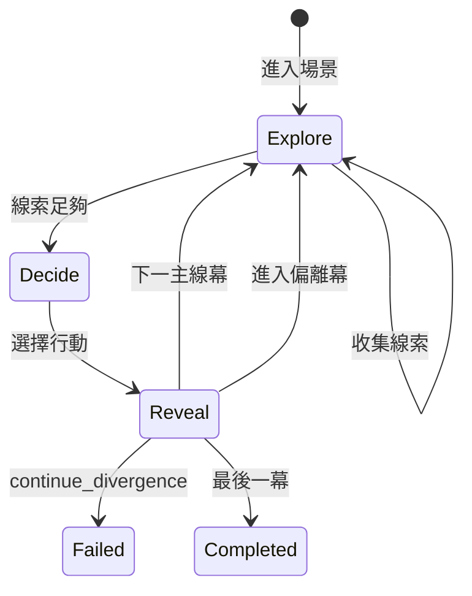

# 沉浸式歷史遊戲改版 — 設計規格

**日期**：2026-06-07  
**狀態**：第一期（秦漢示範）已實作 — 2026-06-07  
**目標用戶**：11 歲左右中小學生（可略降閱讀門檻）  
**設計方向**：A（身歷其境第一人稱）+ C（探索線索後抉擇）  
**採用方案**：三幕式場景（探索 → 抉擇 → 揭曉），分兩期交付

---

## 1. 問題陳述

現有玩法本質是「二元史實測驗」：每幕兩個大按鈕，頂部標示「正史之路 / 偏離史實」，顏色已暗示答案。角色選擇不影響敘事，偏離分支缺乏平行故事。自動生成的劇本甚至直接使用「符合史實的選擇」作為選項文字。

**成功標準**：小朋友玩完後能說「我當時真的在場做決定」，並理解「為什麼歷史走了這條路」。

---

## 2. 核心玩法：三幕式場景

每一幕（Scene）由三個階段組成，玩家依序推進：

```
探索 (explore) → 抉擇 (decide) → 揭曉 (reveal)
```

| 階段 | 目的 | 玩家行為 |
|------|------|----------|
| 探索 | 建立當下情境、收集判斷依據 | 點擊插畫熱點，閱讀線索卡 |
| 抉擇 | 以第一人稱做出行動 | 從 3 個具體行動中選一（無 meta 標籤） |
| 揭曉 | 連結選擇與史實、強化學習 | 顯示判定 + 史書解說，再進下一幕 |

**偏離分支**：揭曉階段若判定為偏離，進入現有 deviation 場景；保留「重返正史 / 繼續偏離 → Game Over」機制，但 deviation 場景亦改為三幕式（探索可精簡為 1 條線索）。

---

## 3. 手機互動設計

### 3.1 探索階段

- **插畫熱點**：SceneIllustrationCard 上疊加 2～4 個可點區域（圓形脈動指示，≥ 44×44pt 觸控目標）
- **線索卡**：點熱點後自底部 sheet 滑出，含標題 + 1～2 句內容 + 說話者（若有）
- **筆記本**：畫面右下角浮動按鈕，顯示「已收集 n / m」；點開列出本幕已收線索
- **解鎖條件**：收集 ≥ `requiredClueCount`（預設 2）後，底部出現「我已了解情勢，做出抉擇 →」按鈕

### 3.2 抉擇階段

- 全屏或半屏面板，頂部一句情境壓力句（例：「朝堂之上，所有人等你的回應——」）
- **3 個行動按鈕**：僅顯示第一人稱台詞，**不顯示** choice type、不顯示綠/黃色 meta 提示
- 按鈕樣式統一（中性色調），避免「選綠就對」

### 3.3 揭曉階段

- 全屏 overlay：印章動畫（✓ 符合史實 / ⚠ 偏離史實）
- **historyNote**（1～2 句）：「史書記載：……」
- **consequence**（1 句）：對遊戲後果的說明
- 「繼續 →」進入下一幕或 deviation 場景

### 3.4 進度與路線

- 頂部進度條保留
- 路線 badge（歷史主線 / 偏離分支）**僅在揭曉後**更新顏色，探索與抉擇階段不顯示
- deviation 橫幅保留，但延後至進入 deviation 場景的探索階段開始時顯示

---

## 4. 資料結構

### 4.1 Scene 擴充

```typescript
interface Scene {
  id: string
  route: RouteType
  narrative: string          // 第三人稱場景描述（探索階段開場）
  narrativeFirstPerson?: string  // 第一人稱版本，支援 {playerName} 佔位符
  resumeMainlineSceneId?: string
  imagePrompt?: ImagePrompt
  illustrationUrl?: string

  // 新增
  hotspots?: Hotspot[]
  requiredClueCount?: number  // 預設 2
  choices: Choice[]           // 抉擇階段選項，建議 3 個
}

interface Hotspot {
  id: string
  label: string              // 熱點名稱（「李斯」「地圖」）
  x: number                  // 0–100 百分比
  y: number
  clue: {
    title: string
    content: string
    speaker?: string         // 「李斯」「民夫」
  }
}

interface Choice {
  id: string
  label: string              // 第一人稱行動台詞
  type: ChoiceType           // 仍用於引擎，UI 不暴露
  nextSceneId: string
  reveal?: {
    verdict: 'historical' | 'divergent' | 'return' | 'persist'
    historyNote: string      // 史書解說
    consequence: string      // 遊戲後果一句
  }
}
```

### 4.2 StoryEngine 擴充

- 新增 `scenePhase: 'explore' | 'decide' | 'reveal'`
- 新增 `collectedClueIds: string[]`（每幕 reset）
- 新方法：`collectClue(hotspotId)`、`advanceToDecide()`、`confirmReveal()`
- `choose()` 在 reveal 確認後才 `applyChoice`

### 4.3 劇本生成（story_generator.py）

自動生成時：
- 每幕生成 2～3 個 hotspots（從 beat 摘要 + characters 推導）
- 每幕 3 個 choices（1 historical + 2 divergent 變體）
- 每 choice 附 reveal 文案
- narrativeFirstPerson 依 analysis.characters 生成
- **禁止**使用「符合史實的選擇」等 meta 文字

### 4.4 Fixture 優先

第一期手改以下 fixture 作為 golden path：
- `qin_han_unification.json`（6 幕，示範主流程）
- `yuefei_golden_medals.json`（MVP 驗收用）

---

## 5. 角色代入

| 項目 | 行為 |
|------|------|
| 選角 | AnalysisResultView 已有，保留 |
| 傳遞 | GamePlayView 接收 `playerCharacter.name` |
| 替換 | `{playerName}` → 角色名；無選角時用「我」 |
| 視角提示 | 探索階段開場加一句「以 {playerName} 的視角，你來到……」 |

---

## 6. 兩期交付範圍

### 第一期 — 「抉擇像真的決定」（優先）

- [ ] 隱藏抉擇階段 meta 標籤與綠黃暗示色
- [ ] 三選一 + 揭曉 overlay（historyNote / consequence）
- [ ] 第一人稱 narrative + choice label
- [ ] `{playerName}` �置符替換
- [ ] 改寫 qin_han + yuefei fixture
- [ ] story_generator 輸出符合新 schema（hotspots 可為空，requiredClueCount=0 跳過探索）
- [ ] StoryEngine scenePhase 狀態機
- [ ] 單元測試更新

**第一期可玩路徑**：探索階段可選「跳過」（requiredClueCount=0），直接進入抉擇+揭曉，驗證 A 方向。

### 第二期 — 「先調查再決定」

- [ ] 插畫熱點 UI + 線索 sheet
- [ ] 筆記本浮動按鈕
- [ ] requiredClueCount 解鎖邏輯
- [ ] fixture 補齊每幕 2～3 hotspots
- [ ] 生成器自動產出 hotspots

---

## 7. 不在本次範圍

- 全屏偵探筆記本 / 人物關係圖（方案二）
- 視覺小說逐句對話樹（方案三）
- 偏離分支完整平行多幕劇情（僅保留現有 1 幕修正機會）
- 後端 API 端點變更（仍用現有 storyGraph JSON）

---

## 8. 測試計畫

| 測試 | 驗證 |
|------|------|
| storyEngine.test.ts | scenePhase 轉換、clue 收集、reveal 後路由 |
| qin_han 路徑 A/B/C | 通關 / 修正 / Game Over 仍成立 |
| 手機 viewport | 熱點 ≥ 44pt、sheet 可滑、三按鈕不溢出 |
| 無選角 | {playerName} 降級為「我」 |

---

## 9. 範例：秦漢第一幕（摘錄）

**探索開場（第一人稱）**  
「以李斯的視角，你站在咸陽殿上。六國歸一，始皇帝等你獻策。」

**Hotspots**

| id | 位置 | 線索 |
|----|------|------|
| lisi | 60%, 35% | 李斯：「若不統一文字，政令如何下達？」 |
| minfu | 30%, 70% | 民夫：「各地仍用舊制，驛站傳令常誤。」 |
| map | 75%, 55% | 地圖：六國舊界仍在，名義統一而已。 |

**抉擇（3 選 1，無 meta）**

1. 「我奏請始皇帝：當即推行書同文、車同軌。」→ historical  
2. 「我建議暫緩改革，先穩定六國舊臣人心。」→ divergent  
3. 「我提議只統一貨幣，文字車軌各郡自定。」→ divergent  

**揭曉（選 1）**  
✓ 符合史實 — 「史書載：秦始皇確實推行書同文、車同軌，奠定大一統基礎。」

---

## 10. 架構圖



---

*待用戶審閱後，進入 writing-plans 產出實作計畫。*
